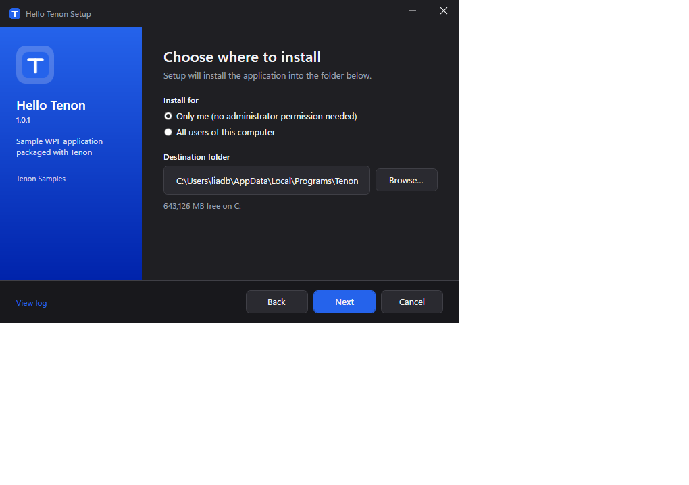

# Tenon

**A modern, readable installer toolkit for .NET desktop apps.** One `tenon.json` in, a real Windows
Installer package (`.msi`) plus a good-looking `Setup.exe` out. No WiX, no XML, no GUID bookkeeping,
no maintenance fee.

[](https://github.com/LiadBenMoshe/tenon/actions/workflows/ci.yml)
[](LICENSE)



## Why

WiX is powerful but verbose, leaks every Windows Installer concept, has a dated UI that is nearly
impossible to restyle, and since version 6 comes with a maintenance fee. Tenon keeps the MSI (IT
departments, GPO, `msiexec /qn`) and hides the machinery behind a small, Inno-Setup-like JSON vocabulary
and a WPF wizard that follows the Windows theme.

## How to use

### 1. Install the tool

```
dotnet tool install -g tenon
tenon doctor
```

Requires Windows and the .NET 8 SDK. `tenon doctor` confirms the setup stub, the custom action DLL and optional tools are in place.

### 2. Describe your installer

Run `tenon init` next to your solution (it finds your WPF/WinForms project) or write `tenon.json` by hand:

```jsonc
{
  "$schema": "https://tenon.dev/schema/v1/tenon.schema.json",
  "build":   { "project": "src/ContosoNotes/ContosoNotes.csproj" },
  "product": { "name": "Contoso Notes", "publisher": "Contoso", "version": "$(AssemblyVersion)",
               "upgradeCode": "6F1B2C0E-9C53-4D8E-9A1E-3B2F0C1D9A77", "icon": "Assets/app.ico" },
  "install": { "scope": "either", "dir": "{autopf}\\Contoso\\Notes", "mainExe": "ContosoNotes.exe" },
  "files":     [ { "from": "{publish}\\**", "exclude": ["*.pdb"], "to": "{app}" } ],
  "shortcuts": [ { "name": "Contoso Notes", "target": "{app}\\ContosoNotes.exe", "in": "{group}" },
                 { "name": "Contoso Notes", "target": "{app}\\ContosoNotes.exe", "in": "{desktop}", "task": "desktopIcon" } ],
  "tasks":     [ { "id": "desktopIcon", "title": "Create a desktop shortcut", "default": true } ],
  "prerequisites": [ { "id": "dotnet-desktop", "version": "8.0" } ],
  "ui":        { "license": "LICENSE.rtf", "theme": { "accent": "#2563EB" } }
}
```

The `$schema` line gives you completion and inline documentation in Visual Studio and VS Code. Paths use
constants such as `{app}`, `{autopf}`, `{group}` and `{desktop}`; the only GUID you ever write is the upgrade code.

### 3. Build

```
tenon build
```

Tenon publishes the project, harvests the output, checks the definition and writes two files into `artifacts/installer`:

| File | For |
|---|---|
| `Contoso_Notes-1.0.0-x64.msi` | IT: `msiexec /i Contoso_Notes-1.0.0-x64.msi /qn`, GPO, Intune, SCCM |
| `Contoso_Notes-Setup-1.0.0.exe` | Users: double-click; installs the .NET runtime first if it is missing |

Try it with `tenon run`, or silently with `tenon run --quiet` and `tenon run --uninstall --quiet`.

### 4. Ship updates

Change the version, run `tenon build` again and distribute the new Setup.exe. Installing it over an older
version upgrades in place. To let the application update itself, add an `update` section, reference the
`Tenon.Update` package and publish releases with `tenon release --to <folder | github:owner/repo>`.
See [docs/updates.md](docs/updates.md).

### 5. Add logic in C# (optional)

```csharp
public sealed class MyHooks : ISetupHooks
{
    [SetupHook(HookStage.AfterInstall)]
    public void WriteConfig(SetupContext ctx)
        => File.WriteAllText(Path.Combine(ctx.InstallDir, "app.json"), $"{{ \"installDir\": \"{ctx.InstallDir}\" }}");
}
```

Reference the `Tenon.Hooks` package from a small class library, point `hooks.project` at it, and Tenon runs
your methods during install, upgrade and uninstall on modern .NET. See [docs/hooks.md](docs/hooks.md).

### 6. Build in CI

```
dotnet publish -c Release -r win-x64 -p:BuildInstaller=true
```

with the `Tenon.MSBuild` package referenced by the application project, or call `tenon build` from the
pipeline. Signing supports a certificate thumbprint, a PFX file or any command template (Azure Trusted Signing).

## What you get

| | |
|---|---|
| **MSI for IT** | A standards-compliant Windows Installer package: silent install, repair, rollback, verbose logs, group policy deployment. |
| **Setup.exe for people** | A WPF wizard that follows the Windows light/dark theme, your accent color and logo. Per-user installs need no administrator prompt; per-machine installs ask exactly once. |
| **Upgrades that just work** | Bump the version, build, ship. The previous version is replaced in place and user settings survive. |
| **Prerequisites** | `.NET Desktop Runtime`, `VC++ Redistributable` or your own package: detected, embedded or downloaded, installed silently. |
| **C# hooks** | Installer logic as plain C# methods running on modern .NET, not .NET Framework. |
| **Everything else desktop apps need** | Shortcuts, file associations, registry, environment variables, Windows services, firewall rules, per-user data cleanup, code signing, launch conditions. |
| **Auto-update** | `Tenon.Update` checks a feed, downloads the new Setup.exe and upgrades in place; `tenon release` publishes the feed. |

## Documentation

- [Getting started](docs/getting-started.md)
- [tenon.json reference](docs/tenon-json.md)
- [Setup hooks in C#](docs/hooks.md)
- [Auto-update](docs/updates.md)
- [CLI reference](docs/cli.md)
- [How it works](docs/architecture.md)
- [Tenon vs WiX](docs/vs-wix.md)
- [Status and roadmap](docs/roadmap.md)

## Samples

- [samples/HelloWpf](samples/HelloWpf): the minimum, plus an in-app update check.
- [samples/FullFeature](samples/FullFeature): hooks, license page, tasks, file association, registry, environment variable, firewall rule, user-data cleanup.

## Repository layout

| Project | Purpose |
|---|---|
| `src/Tenon.Core` | Definition model, JSON loading, macros, path constants, file harvesting, lint, JSON schema generator |
| `src/Tenon.Msi` | Planner, MSI table emitter, sequence builder, Windows Installer database writer (DTF 5.0.2), hooks packaging |
| `src/Tenon.Cab` | Cabinet planning and writing |
| `src/Tenon.Native` | P/Invoke declarations for `msi.dll` and friends |
| `src/Tenon.Payload` | Setup.exe payload container and runtime manifest |
| `src/Tenon.Setup` | The WPF setup stub: wizard, MSI runner, elevation helper, prerequisites, Add/Remove Programs registration |
| `src/Tenon.CustomAction` | NativeAOT custom action DLL: hooks, .NET check, firewall, app-data cleanup, launch |
| `src/Tenon.HookHost` | Runs the developer's hooks assembly inside a custom action |
| `src/Tenon.Hooks` | The hooks SDK (NuGet `Tenon.Hooks`) |
| `src/Tenon.Update` | The auto-update runtime (NuGet `Tenon.Update`) |
| `src/Tenon.Cli` | The `tenon` dotnet tool |
| `src/Tenon.MSBuild` | `dotnet publish -p:BuildInstaller=true` integration |
| `tests/` | Unit tests, golden-table tests, end-to-end scripts |

## Building from source

Windows with the .NET 8 SDK. The custom action DLL is NativeAOT and needs the MSVC toolchain (Visual Studio C++ workload).

```
dotnet build Tenon.sln
dotnet test Tenon.sln
./build/publish-assets.ps1     # setup stub, custom action DLL, hook host (win-x64)
./build/pack.ps1               # NuGet packages into artifacts/packages
```

## Contributing

Issues and pull requests are welcome. Please read [CONTRIBUTING.md](CONTRIBUTING.md) first; it explains how the
code is organized, how to run the tests and what a good change looks like.

## License

Copyright (c) 2026 Liad Ben Moshe. Released under the [MIT License](LICENSE).

Tenon uses the WiX Deployment Tools Foundation libraries (MS-RL, version 5.0.2) unmodified to talk to
`msi.dll` and to build cabinets; see [THIRD-PARTY-NOTICES.md](THIRD-PARTY-NOTICES.md).
